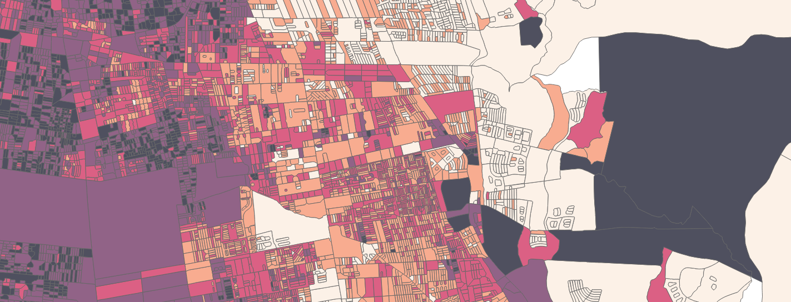

# cl-census24-zone-design

## Overview

This repository contains tools and workflows to preprocess Chilean Census 2024 polygon data in support of statistical zone design.

The primary objective is to transform the smallest urban census areas, known in Chile as manzanas censales, which were originally created as separate polygon features with gaps between them, into a contiguous spatial representation.

The resulting areas will be suitable for use as inputs in zone design software that requires contiguous polygons to identify potential neighboring units for merging. This process is commonly used to generate zones that support the release of small-area statistics and facilitate spatial analysis with more stable population estimates.

---

## Project Status 🚧

Work in progress.

This project is under active development.  
Methods, data structures, and outputs may change as the workflow is refined.

---

## Specific Aims

- Integrate the urban and rural smallest census polygon datasets (manzanas censales and entidades rurales) into a single, unified dataset
- Convert multipart geometries to single-part polygons, including:
  - Relabelling unique identifiers
  - Reassigning population counts where splits occur
- Generate Voronoi (Thiessen) polygons based on the smallest available census spatial units
- Ensure geometric and topological consistency of the resulting Voronoi-based areas, including:
  - Contiguity
  - Absence of gaps and overlaps
  - Valid polygon geometries

---

## Intended Outputs

- Analysis-ready spatial units for statistical zone construction
- Reproducible preprocessing workflows implemented in Python

---

## Disclaimer

This repository is **not an official product** of the Chilean National Statistics Institute (INE).  
It is intended solely for research, experimentation, and methodological development.

## Versión en Español

Para la versión en español de este README, haga clic [aquí](README_es.md).